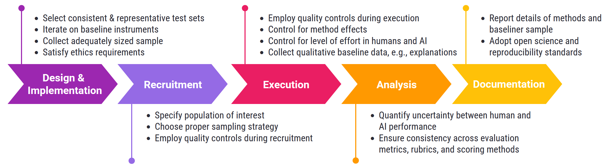

# Recommendations and Reporting Checklist for Rigorous & Transparent Human Baselines in Model Evaluations

**Authors** (* = equal contribution): 
- Kevin L. Wei* (RAND, Harvard)
- Patricia Paskov* (RAND)
- Sunishchal Dev* (RAND, Algoverse)
- Michael J. Byun* (RAND)
- Anka Reuel (Stanford, Harvard)
- Xavier Roberts-Gaal (Harvard)
- Rachel Calcott (Harvard)
- Evie Coxon (Max Planck School of Cognition)
- Chinmay Deshpande (Center for Democracy & Technology)

**Contact**: kevinwei@acm.org

**Other versions**:
- ICML 2025: A version of this paper has been accepted to ICML 2025 as a position paper (spotlight), with the title: "Position: Human Baselines in Model Evaluations Need Rigor and Transparency (With Recommendations & Reporting Checklist)."
- ICLR 2025 Workshop on Building Trust in Language Models and Applications: a version of this paper was presented at this workshop. Reviews and the earlier draft are available on [OpenReview](https://openreview.net/forum?id=VbG9sIsn4F).

## Executive Summary

This paper finds that existing human baselines are neither sufficiently rigorous nor transparent to enable meaningful comparisons of human vs. AI performance. We provide recommendations and a reporting checklist to increase rigor and transparency in human baselines. 

Human baselines are reference sets of metrics intended to represent human performance on specific tasks. They are used in AI evaluations to compare human vs. AI performance on evaluation items, adding important context to results and helping inform stakeholders in the broader AI ecosystem (e.g., downstream users, policymakers). 

Specifically, this paper makes three contributions:

1. **Methodological recommendations**  
   Based on a meta-review of the measurement theory and AI evaluation literatures, we provide methodological recommendations for evaluators to build rigorous human baselines in AI evaluations. See the summary in [Summary of Methodological Recommendations for Human Baselines](#summary-of-methodological-recommendations-for-human-baselines).

2. **Reporting checklist**  
   We provide a reporting checklist for evaluators to increase transparency when publishing human baselines. See `/reporting_checklist/`.

3. **Literature review**  
   We review 115 human baselines (studies) to identify methodological gaps in existing AI evaluations, and we find substantial shortcomings in the rigor and transparency of existing human baselines.

Maximal rigor may not be possible in all human baselines due to resource limitations. In these cases, we hope to help researchers make informed tradeoffs, discuss/acknowledge methodological limitations, narrow interpretation of results, and transparently report methods and results. 

## Stages of the Human Baseline Lifecycle

| **Human Baseline Stage**         | **Definition**                                                                                                                                                                                                                                                      |
| -------------------------------- | ------------------------------------------------------------------------------------------------------------------------------------------------------------------------------------------------------------------------------------------------------------------- |
| Baseline Design & Implementation | Baseline design is the initial stage of human baseline development, at which researchers define baselines’ purpose, scope, concepts, evaluation items, and metrics; baseline implementation is the selection and construction of tools and datasets for evaluation. |
| Baseliner Recruitment            | Baseliner recruitment is the stage at which human baseliners---the humans who respond to evaluation items---are found and are engaged to participate in a baseline.                                                                                                 |
| Baseline Execution               | Baseline execution is the stage at which the human baseline is conducted and result data is collected---e.g., through surveys or crowdwork platforms.                                                                                                               |
| Baseline Analysis                | Baseline analysis is the stage after data collection at which human baseline data is inspected and compared to AI results.                                                                                                                                          |
| Baseline Documentation           | Baseline documentation is the provision of evaluation tasks, datasets, metrics, and experimental materials and resources to relevant audiences.                                                                                                                     |


## Summary of Methodological Recommendations for Human Baselines

<p align="center">
    
    <br><em>A summary of our recommendations for robust and transparent human baselines. More details are in the table below.</em>
</p>

| **Recommendation**                                                                             | **Details**                                                                                                                                                                                                                                                                                                                                                                                                                                                                                                                                                                                                                                                                                                                                                                       |
| ---------------------------------------------------------------------------------------------- | --------------------------------------------------------------------------------------------------------------------------------------------------------------------------------------------------------------------------------------------------------------------------------------------------------------------------------------------------------------------------------------------------------------------------------------------------------------------------------------------------------------------------------------------------------------------------------------------------------------------------------------------------------------------------------------------------------------------------------------------------------------------------------- |
| **Baseline Design & Implementation**                                                           |                                                                                                                                                                                                                                                                                                                                                                                                                                                                                                                                                                                                                                                                                                                                                                                   |
| Use consistent & representative test sets for human baselines and AI results                   | <ul><li>Use the same test set for human baselines and AI results.</li><li>If using a subset of the full test set for human baselines, calculate AI results on that subset and make comparisons only on that subset.</li><li>If using a subset of the full test set for human baselines, select the subset randomly or stratify on relevant criteria (e.g., based on question difficulty, topic, dataset source, etc.).</li></ul>                                                                                                                                                                                                                                                                                                                                                  |
| Iteratively develop baseline instruments                                                       | <ul><li>Validate, collect feedback, and refine human baseline instruments such as survey questions, instructions, training materials (analogous to refining AI prompts or other materials).</li><li>Examples of iterative development processes include (roughly in ascending order of cost/effort): expert validation, pre-tests of baseline instruments, focus groups, and pilot studies.</li></ul>                                                                                                                                                                                                                                                                                                                                                                             |
| Collect an adequately sized sample of baseliners                                               | <ul><li>For generalist (non-expert) baselines, conduct a statistical power analysis to ensure that your baseliner sample size is sufficiently large to represent the human population of interest for your baseline.</li><li>A rule of thumb is that a sample of 1,000 respondents is needed to represent the U.S. adult population</li><li>If baseliner samples must be smaller due to resource limitations, consider: 1) narrowing population of interest, 2) calculating and reporting the required sample size to reliably detect effects (even if researchers are unable to collect a sample of that size), and 3) narrowing interpretations of baseline results.</li><li>For expert baselines, see discussion in Appendix \ref{sec\:Appendix\_Expert\_Baselines}.</li></ul> |
| Satisfy ethics requirements for human subjects research                                        | <ul><li>Ensure ethics requirements are followed, e.g., collecting informed consent, ethics (IRB) review, and other human subjects protections.</li><li>Report which ethics requirements were necessary/satisfied for your baseline.</li></ul>                                                                                                                                                                                                                                                                                                                                                                                                                                                                                                                                     |
| **Baseliner Recruitment**                                                                      |                                                                                                                                                                                                                                                                                                                                                                                                                                                                                                                                                                                                                                                                                                                                                                                   |
| Specify a human population of interest                                                         | <ul><li>Specify which subset of humans the baseline is intended to represent.</li><li>Define your population using dimensions such as geographic location, demographic characteristics (e.g., age, gender, socioeconomic status), language, cultural background, education, or domain expertise.</li><li>Narrow your population of interest so that you aren't attempting to estimate metrics for all humans.</li></ul>                                                                                                                                                                                                                                                                                                                                                           |
| Use an appropriate sampling strategy for selecting baseliners                                  | <ul><li>For generalist (non-expert) baselines, random sampling is ideal, but crowdwork samples are often the norm due to cost considerations. When using crowdwork samples, consider methodological adjustments to make your sample more representative of the underlying human population of interest---e.g., stratified sampling, survey weights, the "representative sample" option in Prolific, etc.</li><li>For expert baselines, convenience samples are acceptable. Clearly define criteria for baseliner eligibility, and consider snowball sampling. See Appendix \ref{sec\:Appendix\_Expert\_Baselines} for additional discussion and case studies in Appendix \ref{sec\:Appendix\_Case\_Studies}.</li></ul>          
| Employ quality controls for baseliner recruitment                                              | <ul><li>Use inclusion/exclusion criteria for baseliners to ensure data quality.</li><li>Consider using pre-qualification tests or screening questions, quality scores (on crowdwork platforms), and excluding baseliners previously exposed to evaluation items.</li><li>Consider excluding the authors or other members of the research team as baseliners if they have been previously exposed to evaluation items (or would otherwise bias results).</li></ul>                                                                                                                                                                                                                                                                                                                 |
| **Baseline Execution**                                                                         |                                                                                                                                                                                                                                                                                                                                                                                                                                                                                                                                                                                                                                                                                                                                                                                   |
| Employ quality controls during baseline execution                                              | <ul><li>Exclude unreliable baseliner responses to improve data quality---e.g., filtering baseliner responses by outliers, time to completion, or other paradata.</li><li>Consider including attention checks, comprehension/manipulation checks, consistency checks, or honeypot questions during the baseline itself.</li><li>If baseliners aren't supposed to use AI tools during baselining, consider including instructions asking participants not to use AI tools, employing technical restrictions such as preventing copy/pasting, using non-standard interface elements, or using comprehension/manipulation checks.</li></ul>                                                                                                                                           |
| Control for method effects and use identical tasks                                             | <ul><li>Method effects are variations in item response attributable to data collection methods rather than to differences in underlying response distributions (e.g., due to instructions, option order, or mode of data collection).</li><li>Use the same tasks for both human and AI responses (i.e., identical instructions, examples, context, etc.).</li><li>Randomize question order, response option order, and other non-critical methodological details.</li><li>Some method effects may be inevitable due to differences between human and AI cognition; consider clearly documenting methodological details and discussing these limitations. See additional discussion in Section \ref{subsec\:Framework\_Execution}.</li></ul>                                       |
| Control for level of effort                                                                    | <ul><li>Make fair comparisons by comparing human and AI results at similar levels of effort---e.g., when given the same amount of time to solve a task, or at similar levels of financial cost.</li><li>AI effort can be affected by inference cost, task time limits, sampling or elicitation strategy, and other factors.</li><li>Human baseliner effort can be affected by training, compensation, task time limits, and other factors.</li></ul>                                                                                                                                                                                                                                                                                                                              |
| Collect qualitative data from baseliners                                                       | <ul><li>Collect qualitative data from baseliners to help surface new insights, e.g., failure modes.</li><li>Qualitative data can include baseliner explanations (about why they chose particular responses), task trajectories, etc.</li><li>Qualitative data may not be necessary for all baselines, especially since collecting such data may increase the cost of baselines.</li></ul>                                                                                                                                                                                                                                                                                                                                                                                         |
| **Baseline Analysis**                                                                          |                                                                                                                                                                                                                                                                                                                                                                                                                                                                                                                                                                                                                                                                                                                                                                                   |
| Quantify uncertainty in human vs. AI performance differences                                   | <ul><li>Report measurements of uncertainty rather than just point estimates---e.g., statistical tests, interval estimates, or distributions of performance.</li></ul>                                                                                                                                                                                                                                                                                                                                                                                                                                                                                                                                                                                                             |
| Use consistent evaluation metrics, scoring methods, and rubrics across human and AI evaluation | <ul><li>Use the same evaluation metrics, scoring methods, and scoring rubrics for both human and AI results.</li><li>When using aggregate metrics such as pass\@k, majority vote, etc., consider using the same aggregate metrics for both human and AI performance (or explaining why it may be appropriate to use different metrics).</li></ul>                                                                                                                                                                                                                                                                                                                                                                                                                                 |
| **Baseline Documentation**                                                                     |                                                                                                                                                                                                                                                                                                                                                                                                                                                                                                                                                                                                                                                                                                                                                                                   |
| Report key details about baselining methodology and baseliners                                 | <ul><li>Report information about baseliners, baselining procedures, and baseline paradata. These details are important for interpreting and assessing baseline results.</li><li>Consider using the reporting checklist we provide in Appendix \ref{sec\:Appendix\_Checklist}.</li></ul>                                                                                                                                                                                                                                                                                                                                                                                                                                                                                           |
| Adopt best practices for open science and reproducibility/replicability                        | <ul><li>Where possible, release (anonymized) human baseline data, experimental materials such as forms or custom UIs, and analysis code.</li><li>Releasing such data helps validate research and may promote re-use of your human baseline in future work.</li></ul>                                                                                                                                                                                                                                                                                                                                                                                                                                                                                                              |
---

## Data Availability

Raw data from our literature review of human baselines is available in `/data/lit_review_data.xlsx`.

Summary statistics are available [here](https://docs.google.com/spreadsheets/d/1dVXwqi4BjGDC5nf-G1tbJ3lTsrdQbqqnHXHafK1svT8/edit?usp=sharing) (provided as a Google Sheet because Excel broke the formulas). 

---

## Repository Structure

```
|-- figures.ipynb
|-- paper.pdf
|-- README.md
|-- repo_tree.txt
|-- data
    |-- lit_review_data.xlsx
    |-- README.md
|-- figures
|   |-- baseline_language_frequencies.png
|   |-- baseline_year_frequencies.png
|   |-- Summary_Figure.png
|   |-- venue_frequencies.png
|-- fonts
|   |
|-- reporting_checklist
    |-- reporting_checklist.docx
    |-- reporting_checklist.pdf
    |-- reporting_checklist.tex
```
---

## License

[CC BY-NC-SA 4.0](https://creativecommons.org/licenses/by-nc-sa/4.0/)